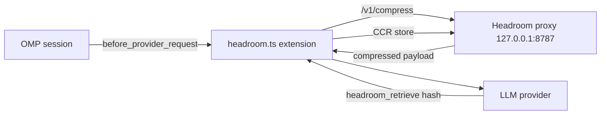

# omp-headroom

[](https://github.com/DarkPhilosophy/omp-headroom/actions/workflows/ci.yml)
[](https://www.gnu.org/licenses/gpl-3.0)
[](https://github.com/chopratejas/headroom)
[](https://rocm.docs.amd.com/)

**omp-headroom** integrates the [Headroom](https://github.com/chopratejas/headroom) context-optimization proxy into [OMP (Oh My Pi)](https://github.com/nicobrenner/oh-my-pi) coding sessions: every provider request flows through a local compression layer that cuts token usage while keeping the original content retrievable, live, from the model itself.

## How it works



- **Provider-path compression** — OpenAI `messages`, Anthropic, and OpenAI Responses (`input`) payloads are compressed before they reach the provider. Oversized tool outputs compress concurrently in a bounded worker pool.
- **CCR retrieval** — compressed content carries a `Retrieve more: hash=…` marker; the model calls the `headroom_retrieve` tool to read the original on demand. Fidelity is never thrown away, only parked.
- **Session archive compaction** — the stable prefix of a long session folds into a single indexed archive message (with a retrievable hash). Archives chain: a later compaction folds the previous archive in, and every archive file is written self-contained so store cleanup can never break the chain.
- **Adaptive thresholds** — as the context window fills (>50%), the "worth compressing" bar drops linearly, down to 25% of the base at 90% usage. More compression exactly when space is scarce.
- **Autoupdate** — the extension checks PyPI daily, upgrades `headroom-ai` in place, re-pins the ROCm torch build when needed, and restarts the proxy.
- **Live widget** — savings, request/tool/CCR counters, archive state, and per-session cost, rendered in a compact 4-row box.

## Install

One-line install (recommended; no `git clone` needed):

```bash
curl -fsSL https://raw.githubusercontent.com/DarkPhilosophy/omp-headroom/main/install.sh | bash
# or
wget -qO- https://raw.githubusercontent.com/DarkPhilosophy/omp-headroom/main/install.sh | bash
```

Persistent shared proxy with `systemd --user`:

```bash
curl -fsSL https://raw.githubusercontent.com/DarkPhilosophy/omp-headroom/main/install.sh | bash -s -- --systemd
```

Developer checkout:

```bash
git clone https://github.com/DarkPhilosophy/omp-headroom.git
cd omp-headroom
./install.sh --systemd
```

`install.sh` flags:

| Flag                           | Meaning                                                                            |
| ------------------------------ | ---------------------------------------------------------------------------------- |
| `--gpu auto\|nvidia\|amd\|cpu` | Torch backend. `auto` probes `nvidia-smi`, `rocm-smi`/`/opt/rocm`, DRM vendor IDs. |
| `--agent-dir DIR`              | OMP agent dir (default `~/.omp/agent`).                                            |
| `--port N`                     | Proxy port (default `8787`).                                                       |
| `--systemd`                    | Install + enable a `systemd --user` unit for a persistent shared proxy.            |
| `--dry-run`                    | Print every mutating step without executing it.                                    |

### GPU support

| Vendor | Torch build                                                                                  | Notes                                                                                                           |
| ------ | -------------------------------------------------------------------------------------------- | --------------------------------------------------------------------------------------------------------------- |
| NVIDIA | default PyPI wheels (CUDA)                                                                   | nothing extra to do                                                                                             |
| AMD    | `torch==2.9.1+rocm6.4` from the [ROCm wheel index](https://download.pytorch.org/whl/rocm6.4) | re-pinned automatically after every `headroom-ai` upgrade, so an update can never silently swap you back to CPU |
| none   | CPU wheels                                                                                   | embedding-based relevance is slower but functional                                                              |

## Widget

```text
╭─ Headroom ─────────────────── 019ebccb ─╮
│ saved 36,132 · 40% · arch 7.6Mch        │
│ req 46 · tool 3 · ccr 12 · arch 7       │
╰─ $0.90 · $130.43 ─────────── ctx $28.80 ─╯
```

Top border: status (rainbow + dashboard link when healthy, gray + truncated error when not) and the short session id. Bottom border: session savings · lifetime savings (left) and the session's accumulated input cost (right).

> **Widget placement caveat:** this extension asks for the `rightEditor` widget slot, which currently exists only in a right-panel OMP fork that has not been merged upstream. On stock OMP the widget renders at the **bottom** of the screen (the default slot) — functional, just a different position. Override with `OMP_HEADROOM_WIDGET_PLACEMENT`.

## Configuration

Everything is environment-driven; defaults are sane. The most useful knobs:

| Variable                                           | Default                                   | Purpose                                                                                                    |
| -------------------------------------------------- | ----------------------------------------- | ---------------------------------------------------------------------------------------------------------- |
| `OMP_HEADROOM_URL`                                 | `http://127.0.0.1:8787`                   | Proxy endpoint.                                                                                            |
| `OMP_HEADROOM_BIN`                                 | `~/.omp/agent/headroom-venv/bin/headroom` | Headroom binary.                                                                                           |
| `OMP_HEADROOM_MIN_TOOL_CHARS`                      | `12000`                                   | Tool-output compression threshold.                                                                         |
| `OMP_HEADROOM_ANTHROPIC_MIN_TOOL_CHARS`            | `8000`                                    | Same, Anthropic `tool_result` blocks.                                                                      |
| `OMP_HEADROOM_ADAPTIVE`                            | on                                        | Adaptive thresholds; `0` disables.                                                                         |
| `OMP_HEADROOM_ADAPTIVE_START` / `_FULL` / `_FLOOR` | `0.5` / `0.9` / `0.25`                    | Context-usage ratio where scaling starts / bottoms out, and the floor as a fraction of the base threshold. |
| `OMP_HEADROOM_SESSION_COMPACTION`                  | on                                        | Session archive compaction; `0` disables.                                                                  |
| `OMP_HEADROOM_LIVE_MESSAGES`                       | `24`                                      | Messages kept verbatim after the archive.                                                                  |
| `OMP_HEADROOM_PREFIX_MIN_CHARS` / `_MIN_SHARE`     | `30000` / `0.45`                          | Minimum prefix size/share before archiving.                                                                |
| `OMP_HEADROOM_RESPONSES_CONCURRENCY`               | `3`                                       | Parallel tool-output compressions per request (1–8).                                                       |
| `OMP_HEADROOM_AUTOUPDATE`                          | on                                        | Daily PyPI check + in-place upgrade; `0` disables.                                                         |
| `OMP_HEADROOM_WIDGET_PLACEMENT`                    | `rightEditor`                             | Widget slot (`rightEditor` needs the right-panel fork).                                                    |
| `OMP_HEADROOM_SESSION_TELEMETRY`                   | off                                       | `1` appends per-compaction JSONL telemetry.                                                                |
| `OMP_HEADROOM_DEBUG`                               | off                                       | `1` logs per-request payload shapes.                                                                       |

<details>
<summary>Full variable reference</summary>

`OMP_HEADROOM_MIN_PROVIDER_CHARS`, `OMP_HEADROOM_ARCHIVE_MAX_MESSAGE_CHARS`, `OMP_HEADROOM_TIMEOUT_MS`, `OMP_HEADROOM_TOOL_TIMEOUT_MS`, `OMP_HEADROOM_ANTHROPIC_PROVIDER`, `OMP_HEADROOM_RAINBOW_MS`, `OMP_HEADROOM_READY_TTL_MS`, `OMP_HEADROOM_STATS_INTERVAL_MS`, `OMP_HEADROOM_PRIORITY`, `OMP_HEADROOM_UPDATE_INTERVAL_MS`, `OMP_HEADROOM_EXTRAS`, `OMP_HEADROOM_CCR_TTL_MS`, `OMP_HEADROOM_CODE_AWARE`, `OMP_HEADROOM_PROXY_ARGS`, `OMP_HEADROOM_SKIP_TOOLS`, `OMP_HEADROOM_FOREIGN_TTL_MS`, `OMP_HEADROOM_WIDGET_MAX_WIDTH`, `OMP_HEADROOM_WIDGET_MIN_WIDTH`, `OMP_HEADROOM_UV`, `OMP_HEADROOM_SYSTEMD_UNIT`, `OMP_HEADROOM_ROCM_TORCH`, `OMP_HEADROOM_ROCM_INDEX`, `OMP_HEADROOM_DISABLED`, `OMP_HEADROOM_TOOL_RESULTS`, `OMP_HEADROOM_WIDGET_ARCHIVE_REASON`, `OMP_HEADROOM_ADAPTIVE_START`, `OMP_HEADROOM_ADAPTIVE_FULL`, `OMP_HEADROOM_ADAPTIVE_FLOOR` — all documented inline in [`extension/headroom.ts`](../extension/headroom.ts).

</details>

## Fidelity model

Two rules, in this order:

1. **Maximum compression** — provider payloads, oversized tool outputs, and the stable session prefix all compress.
2. **Never lose the original** — every compression leaves a `hash=` marker whose original is stored (proxy store + on-disk fallback). Session archives chain and each archive file inlines its ancestors, so even store cleanup cannot orphan history.

## Repository layout

```text
extension/headroom.ts     OMP extension (mirrored artifact of the installed copy)
plugins/headroom-omp-stats  proxy plugin: /v1/compress outcomes → /stats
systemd/                  headroom-proxy.service template
install.sh                venv + GPU-matched torch + extension + unit
tests/                    compactor + adaptive threshold suites (bun test)
.scripts/                 scan-leaks (pre-publish gate), sync-extension (live diff)
```

## Development

```bash
bun run verify   # bun --check + bun test + leak scan
bun run lint     # eslint on tests/.scripts
bun run lint:py  # ruff on the proxy plugin
bun run sync     # diff repo copy vs installed extension
```

## Support

If this saves tokens, cost, or time in your OMP workflow, sponsor continued development:

- GitHub Sponsors: <https://github.com/sponsors/DarkPhilosophy>

GitHub also reads [FUNDING.yml](FUNDING.yml) for the repository sponsor button.

## Credits

- [**Headroom**](https://github.com/chopratejas/headroom) (`headroom-ai`, Apache-2.0) — the compression proxy this project drives. All SmartCrusher/CCR magic is upstream work.
- [**AMD ROCm**](https://rocm.docs.amd.com/) and the [PyTorch ROCm wheels](https://download.pytorch.org/whl/rocm6.4) — GPU acceleration on Radeon hardware.
- [**OMP (Oh My Pi)**](https://github.com/nicobrenner/oh-my-pi) — the coding agent this extension plugs into.

## License

[GPL-3.0-or-later](../LICENSE). Third-party components are listed in [THIRD_PARTY_NOTICES.md](THIRD_PARTY_NOTICES.md).
