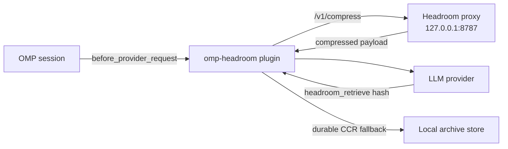
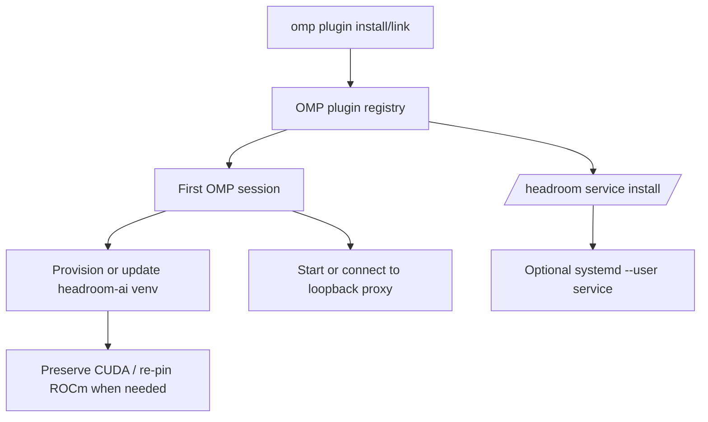
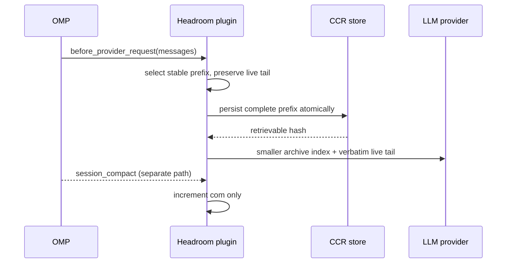

# omp-headroom

[](https://github.com/DarkPhilosophy/omp-headroom/actions/workflows/ci.yml)
[](https://www.gnu.org/licenses/gpl-3.0)
[](https://github.com/chopratejas/headroom)
[](https://rocm.docs.amd.com/)

**omp-headroom** integrates the [Headroom](https://github.com/chopratejas/headroom) context-optimization proxy into [OMP (Oh My Pi)](https://github.com/can1357/oh-my-pi) coding sessions. Eligible provider payloads pass through a local compression layer only when Headroom proves a strict token reduction and the extension has persisted the original for retrieval.

> **Current release: [`0.1.2`](https://github.com/DarkPhilosophy/omp-headroom/releases/tag/v0.1.2)** — fixes invalid Unicode payloads when session archives truncate astral characters or receive malformed UTF-16. GitHub is the canonical release and documentation source.

## How it works



- **Provider-path compression** — eligible OpenAI `messages`, Anthropic, and OpenAI Responses (`input`) payloads are compressed before they reach the provider. Oversized tool outputs compress concurrently in a bounded worker pool.
- **Automatic provider archive** — before proxy compression, a sufficiently large stable conversation prefix is replaced only on the outbound request by a shorter structural index. The complete prefix is persisted to CCR first, while the newest 24 messages remain verbatim. This is the original source of widget `arch`; it is independent of OMP compaction.
- **Strict reduction gate** — a candidate is accepted only when Headroom reports `tokens_after < tokens_before`, the actual outgoing payload is smaller, every user message is unchanged, and a local CCR fallback was persisted. Otherwise OMP sends the original payload unchanged and does not inject the retrieval tool.
- **CCR retrieval** — accepted content carries a `Retrieve more: hash=…` marker; the model calls `headroom_retrieve` to read the original. The proxy store is backed by an atomic on-disk fallback.
- **Headroom-assisted OMP compaction (`/headroom compact`)** — unlike OMP's plain `/compact`, this command arms a one-shot `session.compacting` hook that atomically archives the complete discarded source to CCR and adds fidelity guidance before OMP creates its semantic LLM summary. If archival fails, OMP still compacts but the plugin does not claim a recoverable archive.
- **Adaptive thresholds** — as the context window fills (>50%), the "worth compressing" bar drops linearly, down to 25% of the base at 90% usage. More compression exactly when space is scarce.
- **Autoupdate** — the extension checks PyPI daily, upgrades `headroom-ai` in place, re-pins the ROCm torch build when needed, and restarts the proxy.
- **Live widget** — savings, provider-native prompt-cache hit rate and traffic, request/tool/CCR counters, archive state, and per-session cost, rendered in a compact 5-row box.

## Install

### npm install

```bash
omp plugin install omp-headroom
omp plugin doctor
```

npm installs do not update themselves — rerun `omp plugin install omp-headroom` to pick up a newer stable release.

### Marketplace install (recommended)

This repository is also an OMP plugin marketplace (`.omp-plugin/marketplace.json`), which gives you managed updates:

```bash
omp plugin marketplace add DarkPhilosophy/omp-headroom
omp plugin install omp-headroom@darkphilosophy
omp plugin doctor
```

Upgrade explicitly with `omp plugin upgrade`, or set the `marketplace.autoUpdate` setting to `auto` to upgrade marketplace plugins automatically at OMP startup. The default `notify` mode only records available updates in the debug log — it does not show a visible prompt.

Start OMP once — the plugin provisions everything itself: it creates the `headroom-ai` virtual environment at `~/.omp/agent/headroom-venv`, installs the current `headroom-ai[all]`, re-pins the ROCm Torch build on AMD hardware, and starts the loopback proxy. No manual step is required, and first-time provisioning runs even with `OMP_HEADROOM_AUTOUPDATE=0` — that switch only disables the daily update poll. For a persistent proxy shared by OMP sessions:

```text
/headroom service install
```

The service command writes only `~/.config/systemd/user/headroom-proxy.service`; it refuses to replace a unit whose contents differ from this release. Inspect or remove the unit yourself before rerunning the command, and remove the managed service explicitly with:

```text
/headroom service uninstall
```

### Checkout / development

```bash
git clone https://github.com/DarkPhilosophy/omp-headroom.git
cd omp-headroom
bun install
omp plugin link .
omp plugin doctor
```

`omp plugin link .` registers the checkout and loads `src/index.ts`; no file is copied into `~/.omp/agent/extensions`.

The OMP plugin owns the complete lifecycle:



Provisioning lives only in the plugin — there is deliberately no separate installer script — so the install path can never drift away from `omp plugin install`, `/headroom update`, and `/headroom service`. If the venv is missing at any session start, the plugin rebuilds it.

Provisioning prefers `uv` when available and otherwise falls back to `python3 -m venv` plus that environment's `pip`; a global `uv` install is not required. Override the fallback interpreter with `OMP_HEADROOM_PYTHON` or the preferred `uv` executable with `OMP_HEADROOM_UV`.

### GPU support

| Vendor | Torch build                                                                                  | Notes                                                                                                           |
| ------ | -------------------------------------------------------------------------------------------- | --------------------------------------------------------------------------------------------------------------- |
| NVIDIA | default PyPI wheels (CUDA)                                                                   | nothing extra to do                                                                                             |
| AMD    | `torch==2.9.1+rocm6.4` from the [ROCm wheel index](https://download.pytorch.org/whl/rocm6.4) | re-pinned automatically after every `headroom-ai` upgrade, so an update can never silently swap you back to CPU |
| none   | Headroom/PyTorch default                                                                      | CPU fallback; embedding-based relevance is slower but functional                                                |

## Commands

Type `/headroom ` in OMP to open argument completion. Commands are intercepted before submission, so they do not appear in the chat transcript or consume provider context.

| Command                          | Purpose                                                                                                                                                                                                                  |
| -------------------------------- | ------------------------------------------------------------------------------------------------------------------------------------------------------------------------------------------------------------------------ |
| `/headroom` or `/headroom stats` | Show proxy, archive, and CCR compression statistics.                                                                                                                                                                     |
| `/headroom on`                   | Enable Headroom for the current session.                                                                                                                                                                                 |
| `/headroom off`                  | Disable Headroom and restore the full provider payload for the current session. Existing CCR archives remain retrievable.                                                                                                |
| `/headroom compact`              | Run OMP semantic compaction with Headroom fidelity guidance and a recoverable CCR copy of the discarded source.                                                                                                          |
| `/headroom clear session`        | Show the destructive-clear warning for current-session CCR files and archive counters. No data is deleted.                                                                                                              |
| `/headroom clear session confirm` | Delete only the current session's owned CCR directory and archive-counter file. Other sessions and unowned legacy CCR files are retained.                                                                                |
| `/headroom test tool`            | Sends a deterministic test corpus through the live Headroom proxy. It opens an isolated native `headroom_compress` result only after the proxy returns a shorter CCR-retrievable result; otherwise it reports a failure. |
| `/headroom test compaction`      | Open an isolated OMP session containing a native compaction fixture. No proxy request is made.                                                                                                                           |
| `/headroom service install\|status\|uninstall` | Create, inspect, or explicitly remove the managed `systemd --user` proxy service. |
| `/headroom help`                 | List every subcommand with its description.                                                                                                                                                                              |
| `/headroom version`              | Show plugin/proxy versions, paths, running status, config location, and autoupdate status.                                                                                                                              |
| `/headroom config`               | Show effective adaptive-threshold, proxy, autoupdate, and sizing-debug settings.                                                                                                                                         |
| `/headroom debug`                | Show proxy and sizing-debug status plus the active diagnostic log path.                                                                                                                                                  |
| `/headroom start`                | Start or connect to the Headroom proxy.                                                                                                                                                                                  |
| `/headroom stop`                 | Stop the extension-owned process or the configured `systemd --user` service.                                                                                                                                             |
| `/headroom restart`              | Restart the Headroom proxy.                                                                                                                                                                                              |
| `/headroom update`               | Check PyPI, update `headroom-ai`, preserve the selected GPU backend, and restart the proxy when required.                                                                                                                |

## Widget

The unified `arch Nch ×M` metric describes automatic provider-prefix archiving in both volume and count:

```text
╭─ Headroom ────────────────────────────── session ─╮
│ saved 192.1k · proxy 6.6% · arch 3.3Mch ×3       │
│ cache 72% · read 184.0k · write 12.0k             │
│ req 99 · tool 2 · ccr 5 · com 3                  │
╰─ $1.23 · $45.67 ──────────────── ctx $8.90 ──────╯
```

In this example, `arch 3.3Mch ×3` means that **three automatic provider archives** succeeded and removed **3.3 million characters in total** from outbound context. The first row reports savings, the dedicated cache row reports provider-native prompt-cache usage for finalized assistant messages, and the third content row reports operation counts for requests, tool compression, CCR artifacts, and OMP compaction.

| Display | Meaning | When it changes |
| --- | --- | --- |
| `saved N` | Proxy tokens saved in the current OMP session. | After Headroom accepts a strictly smaller provider payload. |
| `proxy N%` | Percentage of attempted proxy input tokens saved. The `proxy` label appears when archive savings share the row; otherwise only `N%` is shown. | Recomputed from the proxy's per-session statistics. |
| `arch Nch ×M` | Cumulative characters removed (`Nch`) and successful automatic provider-prefix archives (`M`) in this session. | Both values increase only after the complete removed prefix is durably stored in CCR and the outbound archive projection is smaller. |
| `cache N% · read A · write B` | Token-weighted provider prompt-cache hit rate, cached tokens read, and tokens written to cache during this live OMP process. | Aggregated from OMP's normalized usage on each finalized assistant message; it observes provider responses and does not change routing. |
| `req N` | Compression attempts recorded for this session. | Increases only when eligible content is sent to the session's `/v1/compress` endpoint; ordinary provider turns that need no compression do not increment it. |
| `tool N` | Oversized tool results successfully compressed. | Increases only after a strictly smaller tool result with a retrievable original is accepted. |
| `ccr N` | New retrievable CCR artifacts created by this process/session. | Increases after a previously unseen original is persisted successfully. |
| `com N` | Count of completed OMP session compactions, including `/compact` and `/headroom compact`. | Increases on OMP's completed `session_compact` event; it never changes `arch`. |
| `(+N)` | Additional activity produced by subagent sessions. | Appears beside `req`, `tool`, or `ccr` when the foreign count is non-zero. |
| `ch` | Characters, not tokens. | Unit suffix for provider-archive source reduction. |
| `k`, `M`, `B` | Decimal abbreviations: thousand, million, billion. | Values are rounded to one decimal place. |
| bottom `$A · $B` | Current-session proxy savings, then lifetime proxy savings. | Loaded from proxy cost statistics. |
| `ctx $N` | Current session's accumulated provider input cost. | Appears only when the value is greater than zero. |

The rainbow, clickable `Headroom` title means the proxy is ready. A gray title shows `off`, `starting…`, installation activity, `offline`, or a truncated error. The top-right value is the first eight characters of the OMP session ID.

Zero-value `arch` and `com` metrics are hidden. Archive totals are persisted per full OMP session ID and hydrated before the first widget render, so the unified `arch Nch ×M` metric survives process restarts and `omp --resume`. `/headroom version` prints the loaded source path and a 12-character SHA-256 build fingerprint for diagnosing stale or duplicate plugin loads.

CCR originals are stored under a validated full OMP session ID (`headroom-ccr/<sessionId>/<hash>.txt`) and are **not expired by wall-clock age**, because a resumable session may still reference them. Cleanup is explicit: `/headroom clear session` only displays the confirmation guard, while `/headroom clear session confirm` removes the current session's owned CCR files and persisted `arch` counters. It does not clear proxy request/lifetime statistics, other sessions, or legacy root-level CCR files whose ownership cannot be proven.



Automatic compression and provider archiving never rewrite visible transcript messages. They alter only a strictly smaller outbound provider payload after its removed bytes are durably retrievable. `headroom_compress` remains an explicit manual operation and therefore returns its compact result visibly.

> **Widget placement caveat:** this extension asks for the `rightEditor` widget slot, which currently exists only in a right-panel OMP fork that has not been merged upstream. On stock OMP the widget renders at the **bottom** of the screen (the default slot) — functional, just a different position. Override with `OMP_HEADROOM_WIDGET_PLACEMENT`.

## Configuration

Configuration can live in `~/.omp/agent/headroom.yml` or in `OMP_HEADROOM_*` environment variables. Environment variables always win; unknown YAML keys are ignored, and a malformed or absent YAML file falls back to environment/default values.


| Variable                                           | Default                                   | Purpose                                                                                                     |
| -------------------------------------------------- | ----------------------------------------- | ----------------------------------------------------------------------------------------------------------- |
| `OMP_HEADROOM_URL`                                 | `http://127.0.0.1:8787`                   | Proxy endpoint.                                                                                             |
| `OMP_HEADROOM_BIN`                                 | `~/.omp/agent/headroom-venv/bin/headroom` | Headroom binary.                                                                                            |
| `OMP_HEADROOM_MIN_TOOL_CHARS`                      | `12000`                                   | Adaptive threshold for individual Responses tool-output compression and the aggregate floor for small-output batches. |
| `OMP_HEADROOM_MIN_PROVIDER_CHARS`                  | `1000`                                    | Minimum size of one individually-small Responses output considered for aggregate batching.                            |
| `OMP_HEADROOM_ANTHROPIC_MIN_TOOL_CHARS`            | `8000`                                    | Same, Anthropic `tool_result` blocks.                                                                       |
| `OMP_HEADROOM_ANTHROPIC_PROVIDER`                  | enabled                                   | Set to `off` to disable safe, isolated Anthropic `tool_result` compression. Holistic conversion is intentionally unsupported. |
| `OMP_HEADROOM_ADAPTIVE`                            | on                                        | Adaptive thresholds; `0` disables.                                                                          |
| `OMP_HEADROOM_ADAPTIVE_START` / `_FULL` / `_FLOOR` | `0.5` / `0.9` / `0.25`                    | Context-usage ratio where scaling starts / bottoms out, and the floor as a fraction of the base threshold.  |
| `OMP_HEADROOM_RESPONSES_CONCURRENCY`               | `3`                                       | Parallel compression workers for oversized individual outputs (1–8); small outputs are aggregated into bounded batches. |
| `OMP_HEADROOM_SESSION_COMPACTION`                  | on                                        | Legacy-compatible switch for automatic provider-prefix archiving; `0` disables `arch`.                       |
| `OMP_HEADROOM_LIVE_MESSAGES`                      | `24`                                      | Recent outbound messages retained verbatim after an automatic archive.                                      |
| `OMP_HEADROOM_PREFIX_MIN_CHARS` / `_SHARE`         | `30000` / `0.45`                          | Minimum stable-prefix size and share required before automatic archival.                                    |
| `OMP_HEADROOM_ARCHIVE_MAX_MESSAGE_CHARS`           | `900`                                     | Maximum per-message excerpt in the structural archive index; full content stays in CCR.                     |
| `OMP_HEADROOM_AUTOUPDATE`                          | on                                        | Daily PyPI check + in-place upgrade; `0` disables the poll only — first-time venv provisioning always runs. |
| `OMP_HEADROOM_WIDGET_PLACEMENT`                    | `rightEditor`                             | Widget slot (`rightEditor` needs the right-panel fork).                                                     |
| `OMP_HEADROOM_DEBUG_SIZING`                        | off                                       | `1` records privacy-safe per-stage sizing decisions without payloads or digests.                            |
| `OMP_HEADROOM_DEBUG`                               | off                                       | `1` logs per-request payload shapes.                                                                        |


<details>
<summary>Full variable reference</summary>

`OMP_HEADROOM_TIMEOUT_MS`, `OMP_HEADROOM_TOOL_TIMEOUT_MS`, `OMP_HEADROOM_ANTHROPIC_PROVIDER`, `OMP_HEADROOM_RAINBOW_MS`, `OMP_HEADROOM_READY_TTL_MS`, `OMP_HEADROOM_STATS_INTERVAL_MS`, `OMP_HEADROOM_PRIORITY`, `OMP_HEADROOM_UPDATE_INTERVAL_MS`, `OMP_HEADROOM_EXTRAS`, `OMP_HEADROOM_CODE_AWARE`, `OMP_HEADROOM_PROXY_ARGS`, `OMP_HEADROOM_FOREIGN_TTL_MS`, `OMP_HEADROOM_WIDGET_MAX_WIDTH`, `OMP_HEADROOM_WIDGET_MIN_WIDTH`, `OMP_HEADROOM_UV`, `OMP_HEADROOM_SYSTEMD_UNIT`, `OMP_HEADROOM_ROCM_TORCH`, `OMP_HEADROOM_ROCM_INDEX`, `OMP_HEADROOM_DISABLED`, `OMP_HEADROOM_ADAPTIVE_START`, `OMP_HEADROOM_ADAPTIVE_FULL`, `OMP_HEADROOM_ADAPTIVE_FLOOR`, `OMP_HEADROOM_RESPONSES_CONCURRENCY`, and `OMP_AGENT_DIR`.

</details>

## Fidelity model

Three rules, in this order:

1. **Never accept proxy token growth** — missing, equal, increasing, fractional, or contradictory Headroom token metrics are rejected even if character count falls.
2. **Archive only a smaller outbound projection** — provider-prefix archival runs only when the complete projected message array is smaller than the original.
3. **Keep the live conversation verbatim** — proxy compression cannot mutate user messages, and provider archiving preserves the configured recent live tail by identity.
4. **Never lose removed bytes** — every proxy compression and automatic prefix archive persists its complete original under a CCR hash before changing the provider payload. Persistence failure means pass-through.

## Repository layout

```text
src/index.ts                 OMP plugin entrypoint and coordinator
src/config.ts                configuration and environment overrides
src/proxy.ts                 proxy URL and readiness primitives
src/compression.ts           strict token/fidelity acceptance gate
src/messages.ts              stable provider-message sizing
src/ccr.ts                   atomic durable CCR storage and retrieval
src/archive-stats.ts          resume-safe per-session archive counter storage
src/session-archive.ts        automatic provider-prefix projection and archive-chain safety
src/widget.ts                widget rendering and statistics summary
src/commands.ts              slash-command metadata and completion
src/tools.ts                 retrieval-tool transport and rendering
tests/                       deterministic behavior suites
```

## Development

```bash
bun install
omp plugin link .
bun run verify
omp plugin doctor
```

## Support

If this saves tokens, cost, or time in your OMP workflow, sponsor continued development:

- GitHub Sponsors: <https://github.com/sponsors/DarkPhilosophy>

GitHub also reads [FUNDING.yml](FUNDING.yml) for the repository sponsor button.

## Credits

- [**Headroom**](https://github.com/chopratejas/headroom) (`headroom-ai`, Apache-2.0) — the compression proxy this project drives. All SmartCrusher/CCR magic is upstream work.
- [**AMD ROCm**](https://rocm.docs.amd.com/) and the [PyTorch ROCm wheels](https://download.pytorch.org/whl/rocm6.4) — GPU acceleration on Radeon hardware.
- [**OMP (Oh My Pi)**](https://github.com/can1357/oh-my-pi) — the coding agent this extension plugs into.

## License

[GPL-3.0-or-later](LICENSE). Headroom itself is Apache-2.0; see [Credits](#credits).
